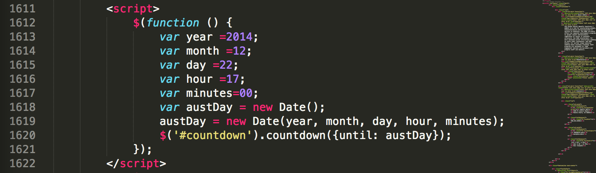

<html>
<head>
	<title>Markdown</title>
	<link rel="stylesheet" type="text/css" href="file:///Users/thessler/Library/Application%20Support/Mou/CSS/Clearness.css">
	<meta name="author" content="Thomas Hessler" href="http://thomashessler.me/">
</head>
<body>
<h1>Change Application Open/Close Date and Time</h1> 
<h5>Go to line 1611 of education.html </h5> 
 
<h5>1. Open a count-down to a date application online to see exactly how much time is left until the open/close  </h5> 
<h5>2. Keep the minutes 00 </h5> 
<h5>3. Change the hour to the open/close hour in military time (See 17 for 5PM) </h5> 
<h5>4. Adjust the rest of the variables (day,month, year) appropriately. It will be  a little bit of trial and error because it is not associated with today's date. For example, the current date it for january 22, but it says on the ticker that it is for the end of december.</h5>
</body>