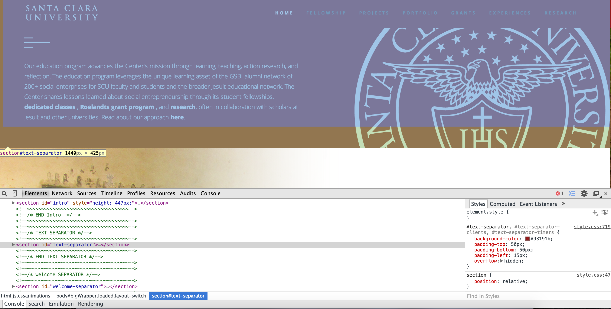
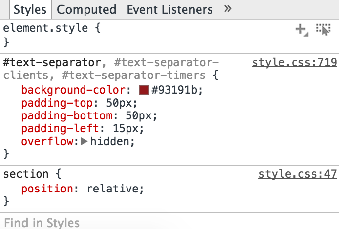
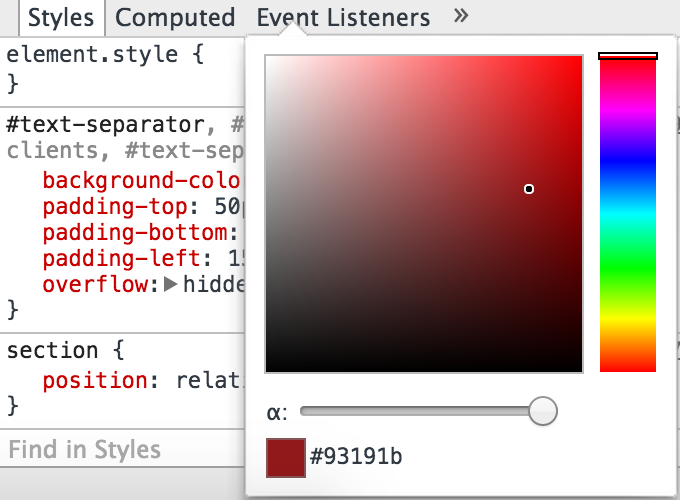

<html>
<head>
	<title>Markdown</title>
	<link rel="stylesheet" type="text/css" href="file:///Users/thessler/Library/Application%20Support/Mou/CSS/Clearness.css">
	<meta name="author" content="Thomas Hessler" href="http://thomashessler.me/">

</head>
<body>
<h5>Change out Colors</h5>
<h7>1. Inspect element on where you would like to change color.</h7> 
 
<h7>2. Change out color within inspect element, to test what it would look like and where else it would change it. 3. Find the line that it refers to in style.css and change the color there.(for our example it's 719)  4. Refresh the page to test!</h7> 
 

</body>
</html>