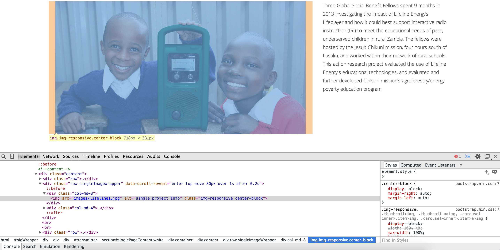
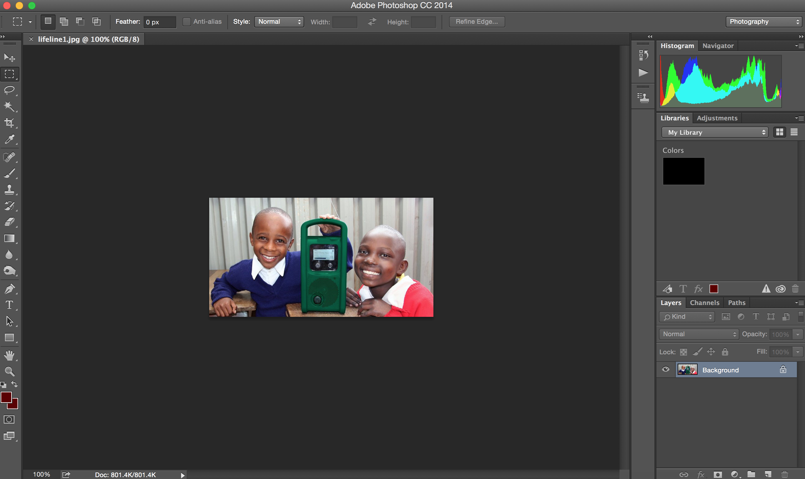
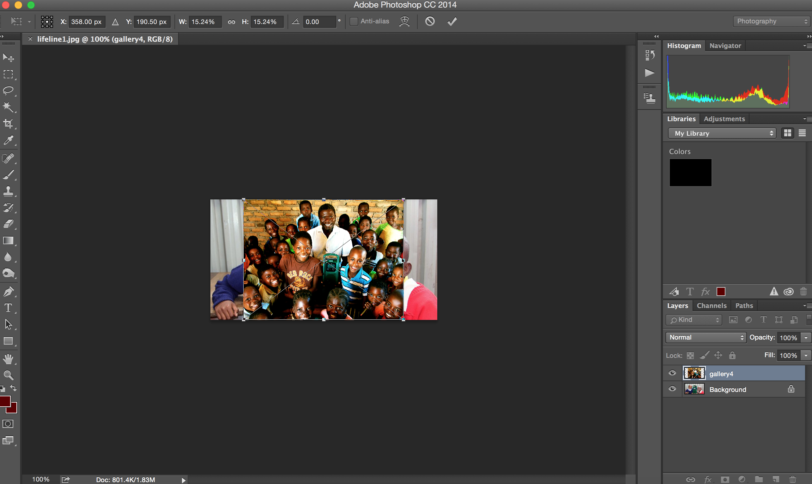
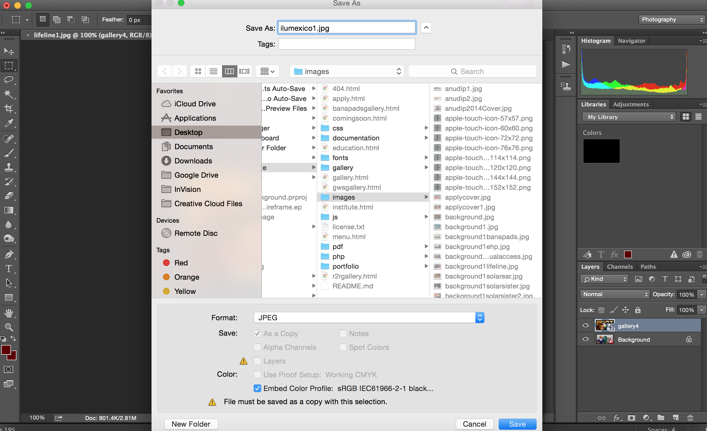

<html>
<head>
	<title>Markdown</title>
	<link rel="stylesheet" type="text/css" href="file:///Users/thessler/Library/Application%20Support/Mou/CSS/Clearness.css">
	<meta name="author" content="Thomas Hessler" href="http://thomashessler.me/">

</head>
<body>
<h5><b>Change the pictures</b></h5> 
<h7>1.For every photo, inspect element and find the photo you would like. For this tutorial, we use lifeline1.jpg.</h7> 
 
<h7>2. Next, Open that image in photoshop. It will be in the /images folder.</h7> 
 
<h7>3. Next, drag and drop your new image (Downloaded from the GoogleDoc) onto the photo opened in Photoshop.</h7> 
 
<h7>4. Next, resize your image to cover the old image. Note: <b>ALWAYS</b> hold shift when you are resizing as to not lose aspect ratios.</h7> 
 
<h7>5. Next, Click OK to approve and resave as a .jpg. Note: It will try to have you rename the photo with a " copy" tag on it. Delete and save a new file. For this one, try ilumexico1.jpg.</h7> 
 
<h7>6. Now, go back to your syntax at ilumexico.html. Command+F to and search for "lifeline1.jpg". Replace "lifeline1" with "ilumexico1". <b> Be sure to include the ".jpg" tag</b></h7> 
 
<h7>7. Refresh your page to make sure it worked!</h7>
</body>
</html>