<html>
<head>
	<title>Markdown</title>
	<link rel="stylesheet" type="text/css" href="file:///Users/thessler/Library/Application%20Support/Mou/CSS/Clearness.css">
	<meta name="author" content="Thomas Hessler" href="http://thomashessler.me/">

</head>
<body>
<h1>Portfolio Documentation</h1>
<h5>ALWAYS BE RUNNING MAMP PRO TO WORK WITH PORTFOLIOS. YOUR LINK TO WORK WITH WILL BE localhost:8888/center-website/education.html</h5>
<h5>THIS IS ONLY FOR EDITING PORTFOLIO PLACEHOLDERS. TO CREATE PORTFOLIO PLACEHOLDERS, PLEASE GO TO PORTFOLIOCREATOR_DOCUMENTATION.MD</h5>
<h5>Begin with a "Coming Soon" Portfolio like so:</h5>
	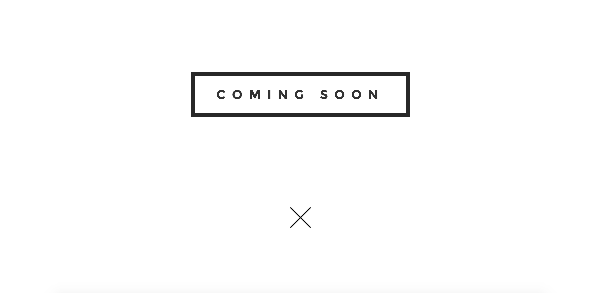
<h5> The syntax looks like this: </h5>
	
<h5>Find a portfolio that you like, copy the syntax, paste into target site.</h5>
<h6>Example use: Lifeline Energy. Target portfolio: Ilumexico.</h6>
<h5>Replace all text where necessary</h5>
<h6>Headers</h6>
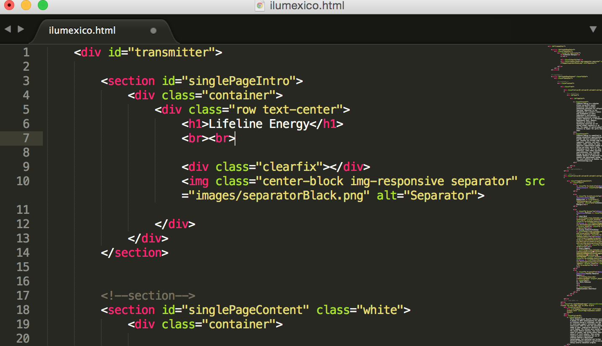
<h7>Change "h1" from Lifeline Energy to Ilum&eacute;xico (Note the escape character)</h7>  
<h7>Change intro paragraphs to the ones indicated in the google doc. Only change the white text.</h7>

<h7> Change date and social enterprise info </h7>
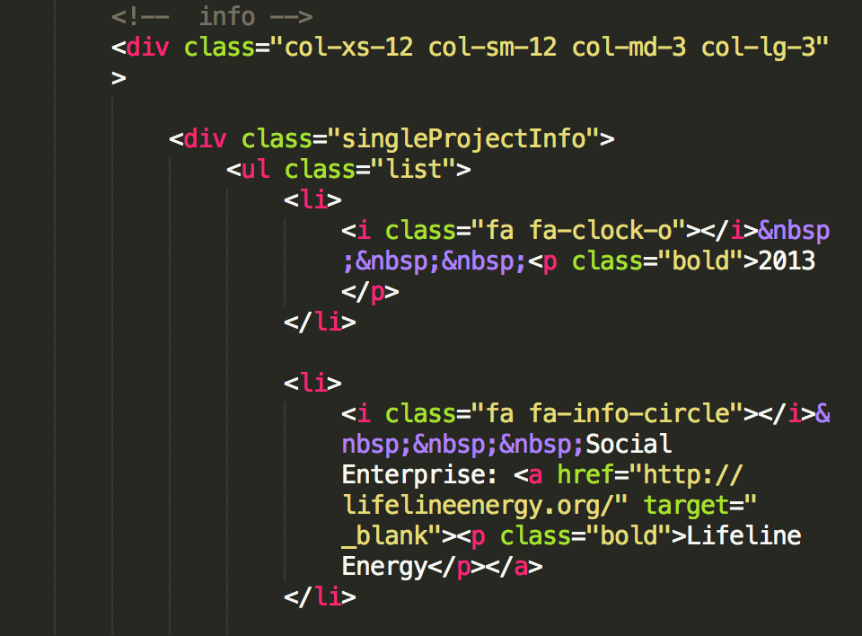
<h7>Change fellow information. Try to get public linkedin link to reference.Note that every "href" tag needs to include a "target="blank"" tag so that it opens in a new tab.</h7> 
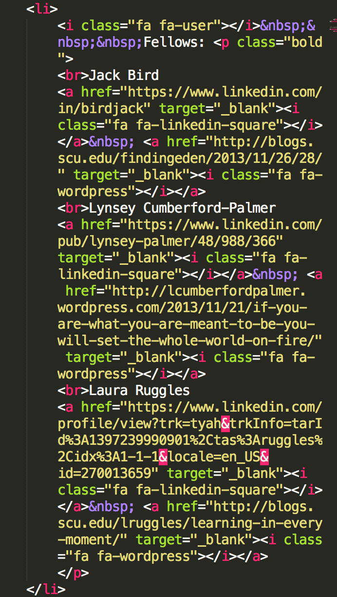 
<h7>Change the rest of the text via the google doc into the specified areas of the document.</h7>
<h5><b>Change the pictures</b></h5> 
<h7>1.For every photo, inspect element and find the photo you would like. For this tutorial, we use lifeline1.jpg.</h7> 
 
<h7>2. Next, Open that image in photoshop. It will be in the /images folder.</h7> 
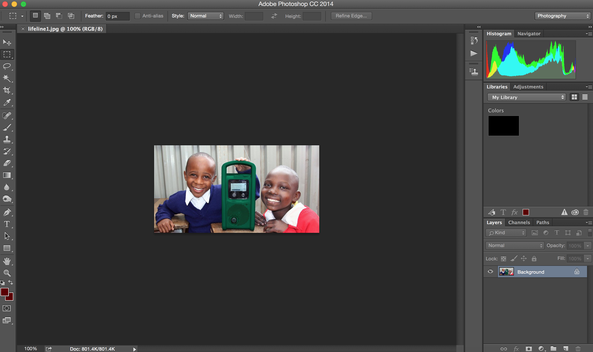 
<h7>3. Next, drag and drop your new image (Downloaded from the GoogleDoc) onto the photo opened in Photoshop.</h7> 
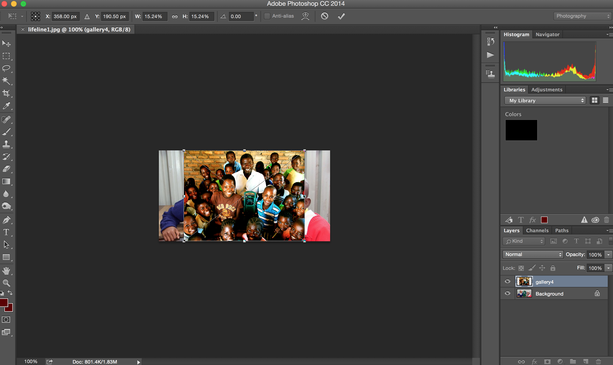 
<h7>4. Next, resize your image to cover the old image. Note: <b>ALWAYS</b> hold shift when you are resizing as to not lose aspect ratios.</h7> 
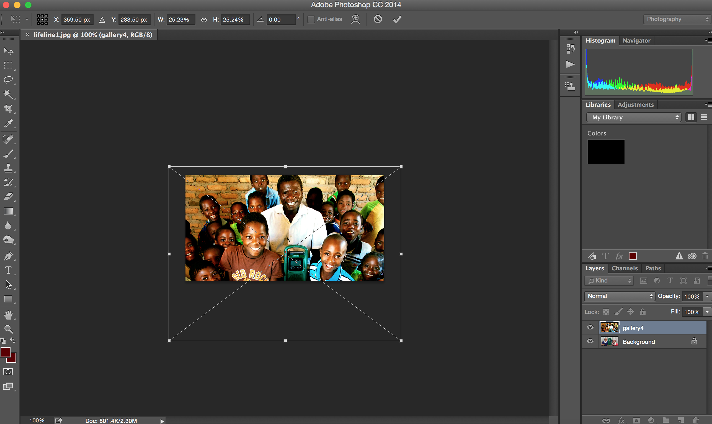 
<h7>5. Next, Click OK to approve and resave as a .jpg. Note: It will try to have you rename the photo with a " copy" tag on it. Delete and save a new file. For this one, try ilumexico1.jpg.</h7> 
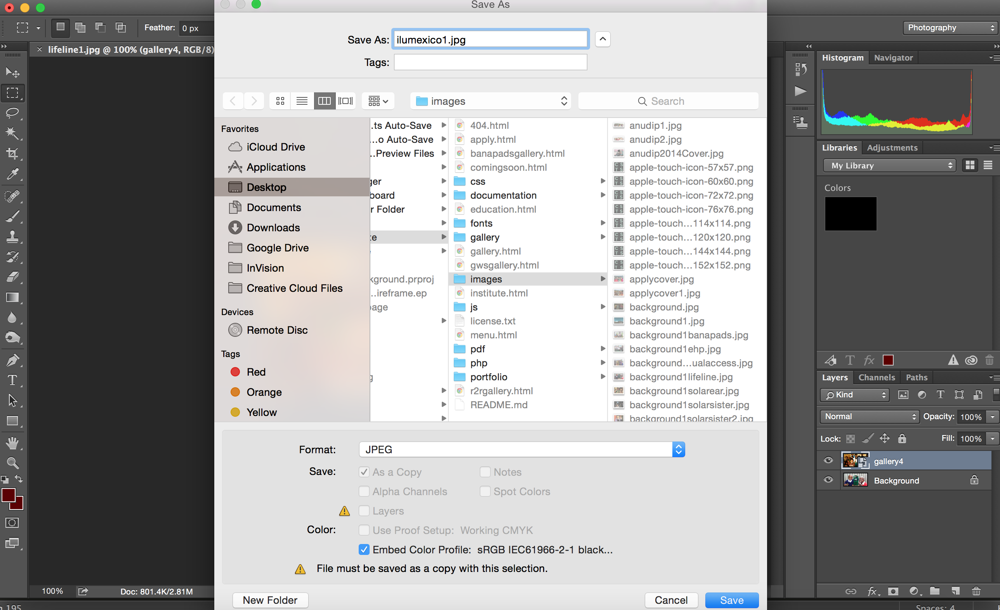 
<h7>6. Now, go back to your syntax at ilumexico.html. Command+F to and search for "lifeline1.jpg". Replace "lifeline1" with "ilumexico1". <b> Be sure to include the ".jpg" tag</b></h7> 
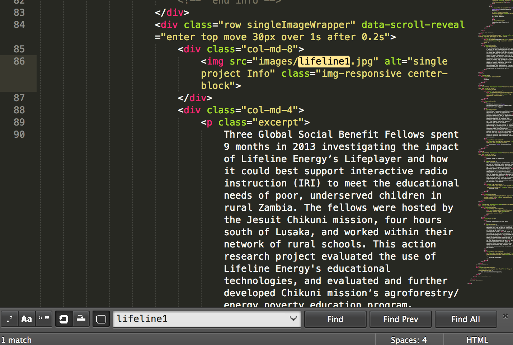 
<h7>7. Refresh your page to make sure it worked!</h7>
<h5>Change Buttons and Add PDF's</h5>
<h7>1. Download 1st PDF to the PDF folder inside center-website. Make sure there is a .pdf tag and that you use a format you can remember. I have used the format of the first two letters of the org (il) and then the year (14), an underscore (_) and then an abbreviation of the deliverable. For the sake of this portfolio, we will be using "il14_rpo.pdf". </h7> 
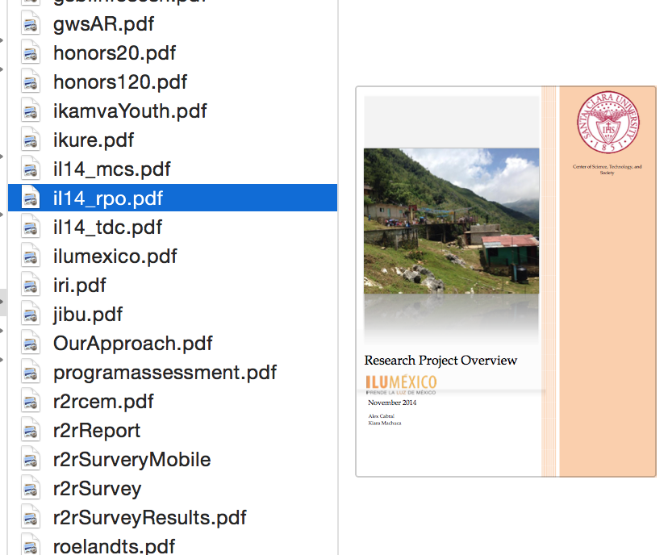 
<h7>2. Next, find the button that correlates with the text that you used for that portfolio. You can search the syntax with the terminology (btn). It will look something like this:</h7>
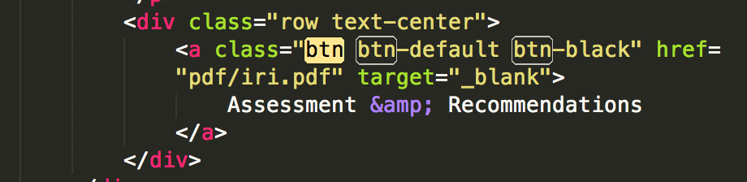 
<h7>3. Finally, change out the pdf tag to the correct pdf. Make sure that there is a "target="blank"" tag included. 
<h7>4. Refresh your page to make sure it worked!</h7>
<h7>5. Make sure that you change out the last button that links to the enterprise website!</h7>
</body>
</html>