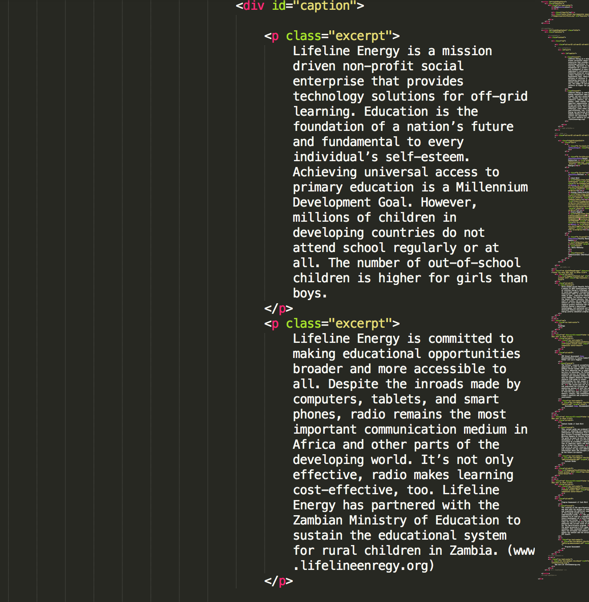

<html>
<head>
	<title>Markdown</title>
	<link rel="stylesheet" type="text/css" href="file:///Users/thessler/Library/Application%20Support/Mou/CSS/Clearness.css">
	<meta name="author" content="Thomas Hessler" href="http://thomashessler.me/">

</head>
<body>
<h1>Portfolio Documentation<h1>
<h5>Begin with a "Coming Soon" Portfolio like so:</h5>
	
<h5> The syntax looks like this: </h5>
	
<h5>Find a portfolio that you like, copy the syntax, paste into target site.</h5>
<h6>Example use: Lifeline Energy. Target portfolio: Ilumexico.</h6>
<h5>Replace all text where necessary<h5>
<h6>Headers</h6>

<h7>Change "h1" from Lifeline Energy to Ilum&eacute;xico (Note the escape character)</h7>  
<h7>Change intro paragraphs to the ones indicated in the google doc</h7>

<h7> Change date and social enterprise info </h7>

<h7>Change fellow information. Try to get public linkedin link to reference.</h7> 

</body>
</html>