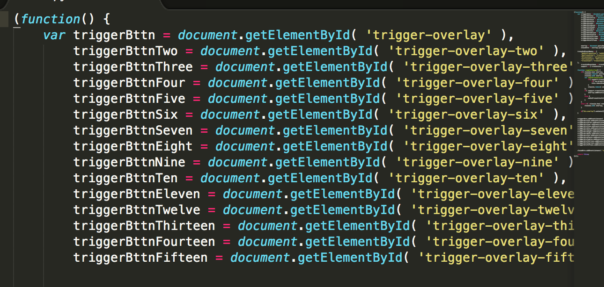

<html>
<head>
	<title>Markdown</title>
	<link rel="stylesheet" type="text/css" href="file:///Users/thessler/Library/Application%20Support/Mou/CSS/Clearness.css">
	<meta name="author" content="Thomas Hessler" href="http://thomashessler.me/">

</head>
<body>
<h1>Portfolio Creation</h1>
<h5>PLEASE DO NOT ATTEMPT UNLESS YOU ARE COMFORTABLE WITH JAVASCRIPT. </h5>
<h5>1. Go to overlay.js in the /js folder. Create a new trigger-overlay-sixteen and so on for the amount of triggers that you will be using for the ajax.   2. Add the same amount of Event Listeners for the associated new triggers. </h5> 
 
 
<h5>2.Go to education.html and create new portfolio holders. To do this, just copy and paste an old portfolio holder below the last portfolio of 2014. Then change the associated text. Follow the steps to replace images so that it is not proportionally off. You will need at least 3 of the small portfolios. A small portfolio is provided here. A big example will be the syntax for ilumexico. </h5> 
 
<h5>3.Within the new portfolio holder, please note that there needs to be a change in the first div class. It needs to be changed to the associated button click. Currently there is only twenty-12, twenty-13, and twenty-14. To create a twenty-15 for next year's portfolios, look below at the btns and copy and paste it into a new button. Then change out the twenty-# to twenty-15 and the text to 2015. This is on lines 699-702 in education.html. Then there will be a button for 2015 and you can call that within the new portfolio holders.</h5> 
 
<h7>4. Refresh your page to make sure it worked!</h7>
</body>
</html>